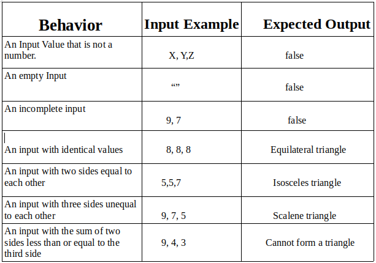

{Triangle Tracker}
#### {A Web page created to determine types of triangles}, {17th February, 2019}
#### By **{Purity Sowayi}**
## Description
{This is a web page that allows a user to input three dimensions of a triangle and from those dimensions, determines whether a triangle is equilateral (all sides equal), isosceles (two sides equal) or scalene (all sides unequal). The page only accepts numerical values and provides an alert upon submitting your values. It is written in HTML using basic format and syntax.
The web page can be viewed on GitHub pages at: https://apwao.github.io/triangle-tracker/}
## Setup/Installation Requirements
* Git must be installed in the computer. Use ($ sudo apt install git-all) to. install if not yet installed
* Install a web browser such as Chrome/Mozilla or Internet explorer.
* Clone the repository from GitHub into your local computer by typing ($ git clone https://github.com/apwao/triangle-tracker.git) in the terminal.
* Open the files using a web browser of your choice.
* Internet connection is required to access the links therein.
## BDD

## Known Bugs
{After submitting values input fields may fail to clear}
## Technologies Used
* HTML
* CSS
* Git
* Javascript
## Support and contact details
{Incase of any issues, ideas, questions or concerns, contact contributor at pasowayi@gmail.com.
In order to contribute to the code: Fork a copy of the repository, push changes to a branch called contributions. Issue a pull request to the contributor.}
### License
Copyright (c) {2019} **{Purity Sowayi}**
}
